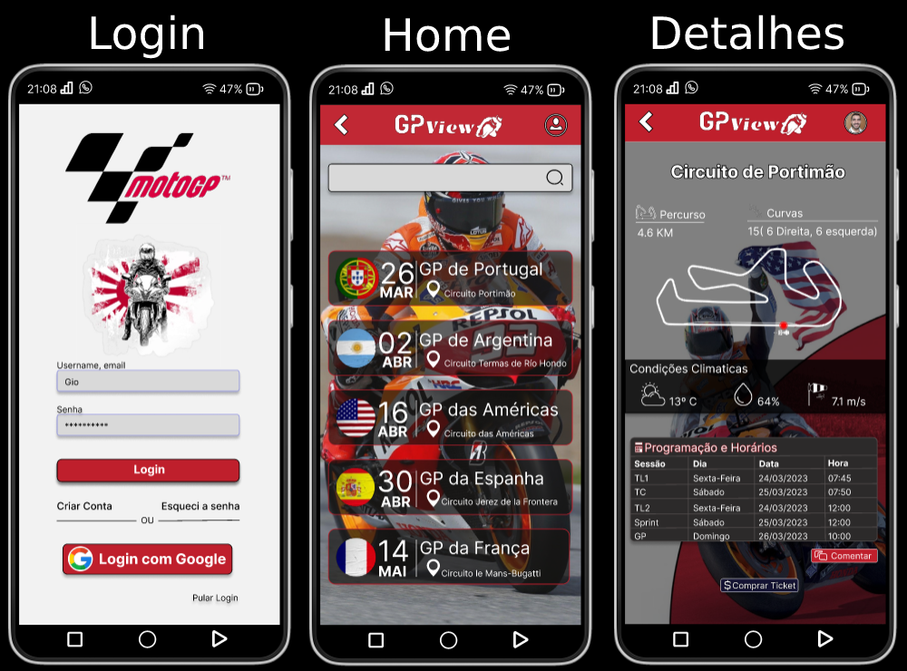

# GPView

[](https://conventionalcommits.org)


<br>
> App for view calendar in Moto GP 2023

The project is still in development and the next updates will focus on the following tasks:

- [X] Prototype on Figma
- [ ] Develop Home frontend
- [ ] Develop Login screen frontend
- [ ] Develop Details screen frontend
- [ ] Develop Registration screen frontend
- [ ] Develop Profile screen frontend
- [ ] Develop Password Recovery screen frontend
- [ ] Develop App Backend

## 💻 Pre-requisites

- NPM: 8.19.2
- Node: v18.12.1
- React-Native-cli: 2.0.1

> `` It is recommended to use **Expo** to run the project. Case not get expo installed, install executing in terminal: npm install --global expo-cli

## 🚀 Using GPView

To use **GPView**, follow these steps:

1 - To use the project, simply install **Visual Studio Code** with the prerequisites mentioned above. `<br>`
  1.1 - Install VS Code: https://www.youtube.com/watch?v=49K-Zxc8A7A  \

2 - Open Visual Studio Code in your Workspace and run the following command in the VSCode terminal:

```
git clone git@github.com:Giovane-F-Moreira/gpview.git
```

```
npm i
```

```
npm start
```

## 📫 Contributing to GPView

To contribute to GPView, follow these steps:

1. Fork this repository.
2. Create a branch: git checkout -b <branch_name>.
3. Make your changes and commit them: git commit -m '<commit_message>'
4. Push to the original branch: git push origin <project_name>/`<location>`
5. Create the pull request.

As an alternative, refer to the GitHub documentation at [How to create a pull request](https://help.github.com/en/github/collaborating-with-issues-and-pull-requests/creating-a-pull-request).

## 🤝 Contributors

<table>
  <tr>
    <td align="center">
      <a href="#">
        <br>
        <sub>
          <b>Giovane Fernandes</b>
        </sub>
        </hr>
      </a>
    </td>
  </tr>
  <tr>
    <td>
       <sub>
          <b>Project Creator</b>
       </sub>
    </td>
  </tr>
</table>

## 📝 Licença

This project is licensed. See the file [LICENÇA](LICENSE.md) for more details.

[⬆ Go back to the top](#nome-do-projeto) `<br>`
